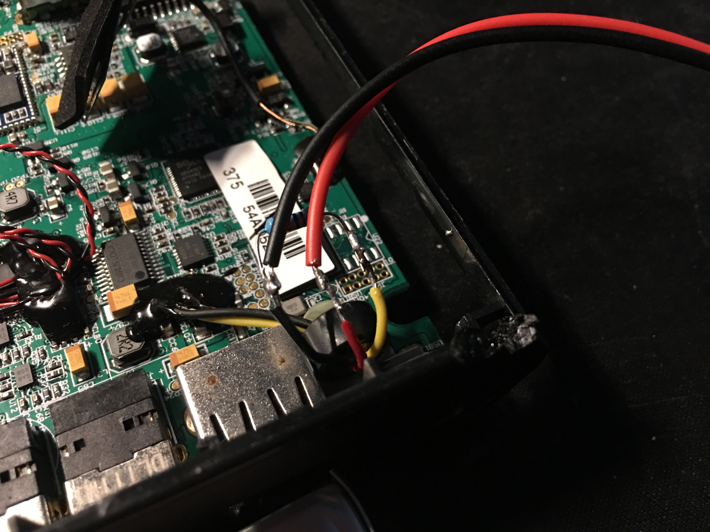
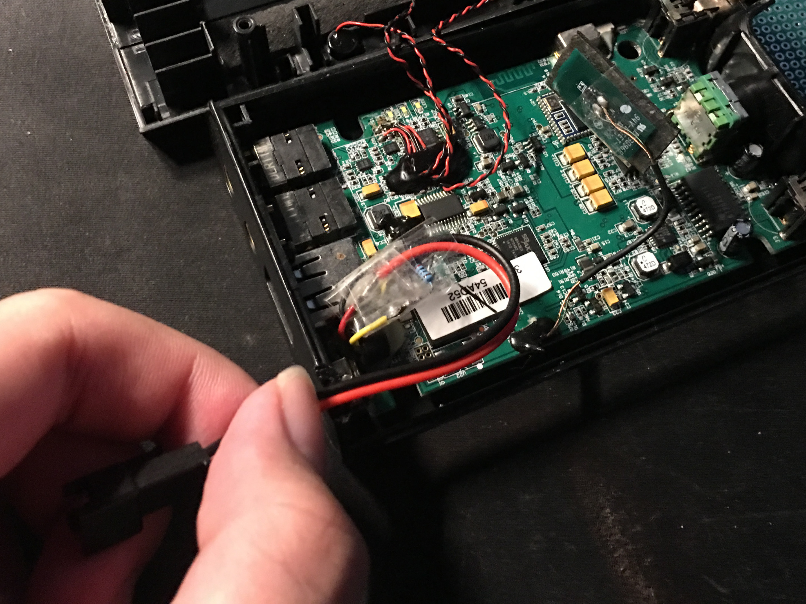
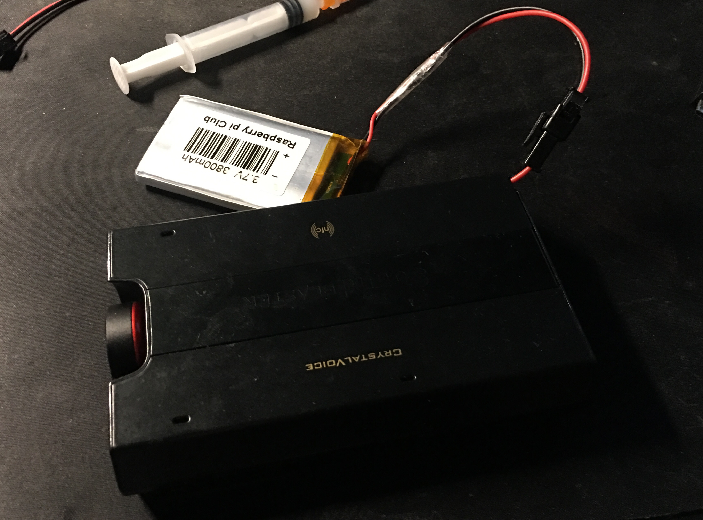

# DIY Battery Replacement

**WARNING** This method will disable battery temperature measurement, so it won't shutdown even if the battery is too hot. Please be aware of the potential risk. 

You need:

* A 3.7v li-ion battery pack
* A resistor between 8.5KΩ and 10KΩ

Open the unit, cut 3 cables connecting the battery, remove the swollen battery carefully, then solder the cables:

* RED: battery pack +3.7V
* BLACK: battery pack GND and one end of the resistor
* YELLOW: another end of the resistor

Notes: 

* Properly isolate the naked cables
* The NFC antenna might not able to firmly attach to the plastic cover, and it have conductive material on the PCB. If it is hanging in the empty space inside the unit, please isolate the PCB too using some insulation tape. 

This picture shows insulated cables and the NFC antenna.

You can choose putting your battery pack inside the unit or outside it. 

