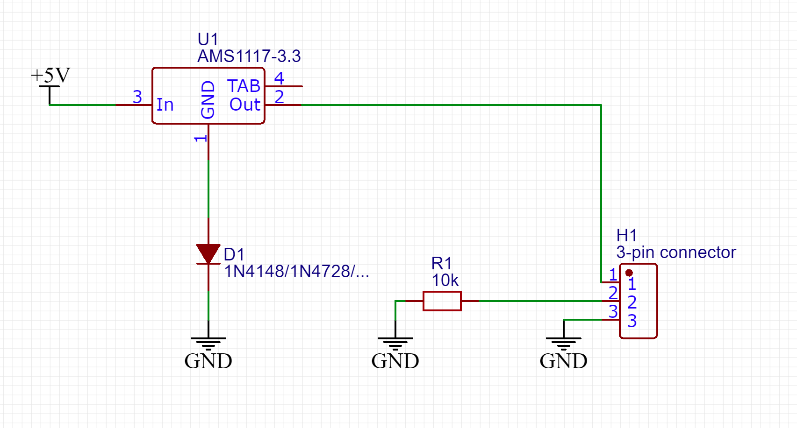

Some WIP work on cheating the power management chip so the unit will boot without a chip.

## The Capacitor Method

Put a large capacitor between +BAT and GND. This method requires an actual battery connected to the capacitor in parrllel for several seconds when the unit is booting; after it has been working steadily you can disconnect the battery. 

## The Voltage Emulation Method

This method emulates a full battery by providing a ~4V voltage to the PMIC. But we cannot easily access any +5V rail on the E5 PCB, thus an external power (e.g. cut your USB cable to get a 5V rail) might be required. 

Credit: this method came from [rgwan](https://github.com/rgwan). 

If you found any way to access +5V on the E5 PCB without heavily modifying it, please contact us. 
