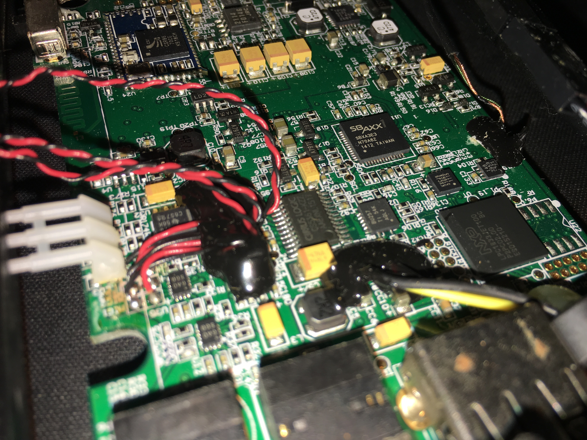

# PCB Front Side

(Source: https://www.head-fi.org/threads/creative-sound-blaster-e5-headphone-amp-usb-dac-with-otg-toslink-aptx-recording-more.732171/page-55 )

(Source: https://blog.swineson.me/creative-sound-blaster-e5-user-experience-and-pcb-picture/)

# PCB Back Side

(Source: https://www.head-fi.org/threads/creative-sound-blaster-e5-headphone-amp-usb-dac-with-otg-toslink-aptx-recording-more.732171/page-55)

(Source: https://blog.swineson.me/creative-sound-blaster-e5-user-experience-and-pcb-picture/)
